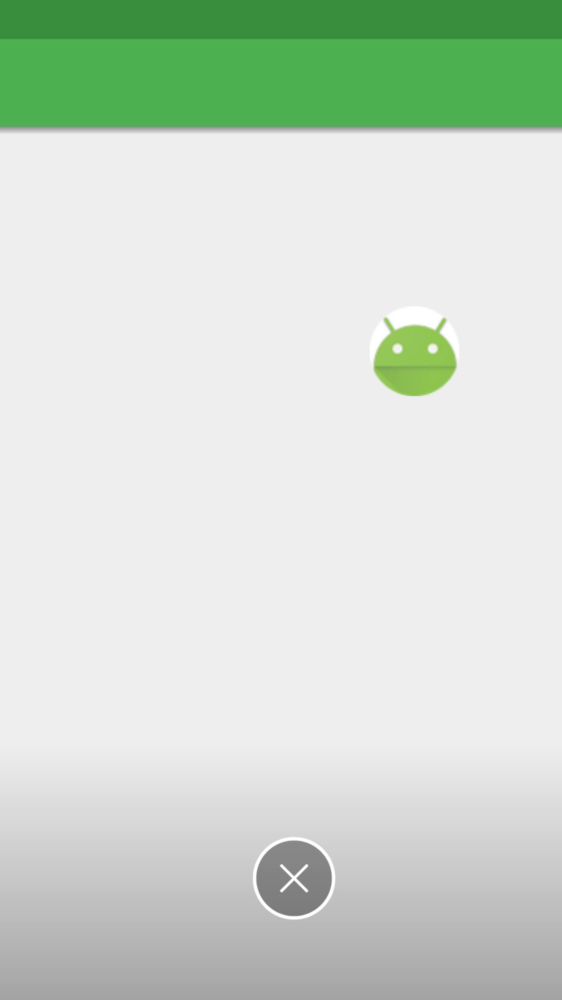
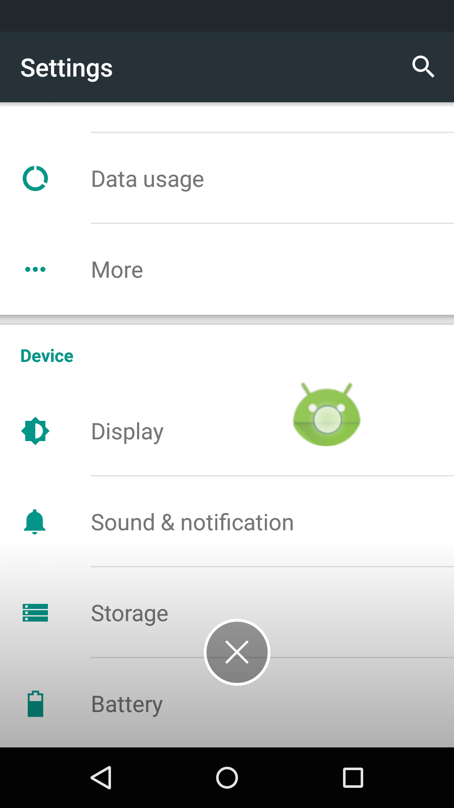

# FloatingView
このAndroidプロジェクトは、チャットや何らかの情報を前面に表示するためのViewです  
AndroidのAPI 14以降に対応しています  

##Screenshots
　
　

  
  
動作の詳細はYouTubeの動画を確認してください  
[SimpleFloating](http://youtu.be/nb8M2p0agF4)  
[FloatingAd](http://youtu.be/PmvbQzxSBU0)

## Requirements
Target Sdk Version : 22  
Min Sdk Version : 14  

##How to use
1) FloatingViewを使用したいプロジェクトに本プロジェクトのlibraryを追加します  
  
2) FloatingViewを表示するためのServiceを定義します 
```java
public class ChatHeadService extends Service {
  ・・・
}
```
  
3) FloatingViewに表示するViewの設定を行います（サンプルではonStartCommandで行っています）  
```java
  final LayoutInflater inflater = LayoutInflater.from(this);
  final ImageView iconView = (ImageView) inflater.inflate(R.layout.widget_chathead, null, false);
  iconView.setOnClickListener(・・・);
```  

4) FloatingViewManagerを使用して、FloatingViewの設定を行います 
```java
  mFloatingViewManager = new FloatingViewManager(this, this);
  mFloatingViewManager.setFixedTrashIconImage(R.drawable.ic_trash_fixed);
  mFloatingViewManager.setActionTrashIconImage(R.drawable.ic_trash_action);
  mFloatingViewManager.addViewToWindow(iconView, FloatingViewManager.SHAPE_CIRCLE, (int) (16 * metrics.density));
```  

なお、FloatingViewManagerの第２引数はFloatingViewListenerです  
  
これは、FloatingViewを終了する際に呼び出される処理(onFinishFloatingView)を記述します  
```java
    @Override
    public void onFinishFloatingView() {
        stopSelf();
    }
```
  
5) AndroidManifestにパーミッションを追加します
```xml
 <uses-permission android:name="android.permission.SYSTEM_ALERT_WINDOW"/>
 <uses-permission android:name="android.permission.VIBRATE"/>
```  
  
6) AndroidManifestにServiceを定義します  
例)
```java
    <application ・・・>
        ・・・
        <!-- デモ表示サービス -->
        <service
            android:name="jp.co.recruit_lifestyle.sample.service.ChatHeadService"
            android:exported="false"/>
        ・・・
    </application>
```
  
7) Serviceを開始する処理を記述します(以下はFragmentの例)
```java
    final Activity activity = getActivity();
    activity.startService(new Intent(activity, ChatHeadService.class));
```
  
補足)FloatingAdServiceを動作させるためには、string.xmlのad_unit_idを自身の広告ID(インタースティシャル)で置き換えてください  
```xml
 <string name="ad_unit_id">ADD_YOUR_UNIT_ID</string>
```  
参考：[アプリに広告ユニット IDを設定する](https://developers.google.com/mobile-ads-sdk/docs/admob/android/quick-start?hl=ja#give_your_app_an_ad_unit_id)  

## Credits

FloatingView is owned and maintained by [RECRUIT LIFESTYLE CO., LTD.](http://www.recruit-lifestyle.co.jp/)

FloatingView was originally created by [Yoshihide Sogawa](https://twitter.com/egg_sogawa)  


##License

    Copyright 2015 RECRUIT LIFESTYLE CO., LTD.

    Licensed under the Apache License, Version 2.0 (the "License");
    you may not use this file except in compliance with the License.
    You may obtain a copy of the License at

       http://www.apache.org/licenses/LICENSE-2.0

    Unless required by applicable law or agreed to in writing, software
    distributed under the License is distributed on an "AS IS" BASIS,
    WITHOUT WARRANTIES OR CONDITIONS OF ANY KIND, either express or implied.
    See the License for the specific language governing permissions and
    limitations under the License.

