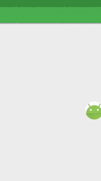

# FloatingView
The Android project is View to display information such as chat in front.  
To API Level 14 or later are supported  

##Screenshots
  


  
*Watch YouTube video*  
[SimpleFloating](http://youtu.be/nb8M2p0agF4)  
[FloatingAd](http://youtu.be/PmvbQzxSBU0)

## Requirements
Target Sdk Version : 23  
Min Sdk Version : 14  

##How to use
1) Add this to your **build.gradle**.
  ```java
  repositories {
      maven {
          url "https://jitpack.io"
      }
  }

  dependencies {
    compile 'com.github.recruit-lifestyle:FloatingView:1.4'
  }
  ```
  
2) Implement Service for displaying FloatingView
```java
public class ChatHeadService extends Service {
  ・・・
}
```
  
3) You will do the setting of the View to be displayed in the FloatingView（Sample have a set in onStartCommand）
```java
  final LayoutInflater inflater = LayoutInflater.from(this);
  final ImageView iconView = (ImageView) inflater.inflate(R.layout.widget_chathead, null, false);
  iconView.setOnClickListener(・・・);
```  

4) Use the FloatingViewManager, make the setting of FloatingView
```java
  mFloatingViewManager = new FloatingViewManager(this, this);
  mFloatingViewManager.setFixedTrashIconImage(R.drawable.ic_trash_fixed);
  mFloatingViewManager.setActionTrashIconImage(R.drawable.ic_trash_action);
  mFloatingViewManager.addViewToWindow(iconView, FloatingViewManager.SHAPE_CIRCLE, (int) (16 * metrics.density));
```  

The second argument of FloatingViewManager is FloatingViewListener
  
Describe the process (onFinishFloatingView) that is called when you exit the FloatingView
```java
    @Override
    public void onFinishFloatingView() {
        stopSelf();
    }
```
  
5) Add the permission to AndroidManifest
```xml
 <uses-permission android:name="android.permission.SYSTEM_ALERT_WINDOW"/>
 <uses-permission android:name="android.permission.VIBRATE"/>
```  
  
6) Define the Service to AndroidManifest
example)
```java
    <application ・・・>
        ・・・
        <!-- Demo -->
        <service
            android:name="jp.co.recruit_lifestyle.sample.service.ChatHeadService"
            android:exported="false"/>
        ・・・
    </application>
```
  
7) Describe the process to start the Service (example of Fragment)
```java
    final Activity activity = getActivity();
    activity.startService(new Intent(activity, ChatHeadService.class));
```
  
Info.
If you want to use the FloatingAdService,replace the ad_unit_id(string.xml) with your ad unit id (Interstitial Ad).
```xml
 <string name="ad_unit_id">ADD_YOUR_UNIT_ID</string>
```  
Reference：[Give your app an Ad Unit ID](https://developers.google.com/admob/android/quick-start?hl=en#give_your_app_an_ad_unit_id)  

## Credits

FloatingView is owned and maintained by [RECRUIT LIFESTYLE CO., LTD.](http://www.recruit-lifestyle.co.jp/)

FloatingView was originally created by [Yoshihide Sogawa](https://twitter.com/egg_sogawa)  


##License

    Copyright 2015 RECRUIT LIFESTYLE CO., LTD.

    Licensed under the Apache License, Version 2.0 (the "License");
    you may not use this file except in compliance with the License.
    You may obtain a copy of the License at

       http://www.apache.org/licenses/LICENSE-2.0

    Unless required by applicable law or agreed to in writing, software
    distributed under the License is distributed on an "AS IS" BASIS,
    WITHOUT WARRANTIES OR CONDITIONS OF ANY KIND, either express or implied.
    See the License for the specific language governing permissions and
    limitations under the License.

